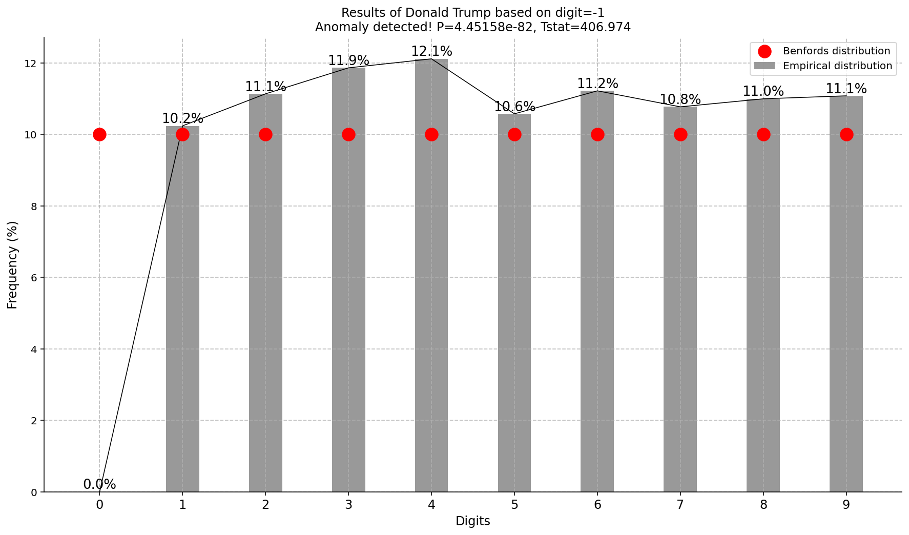
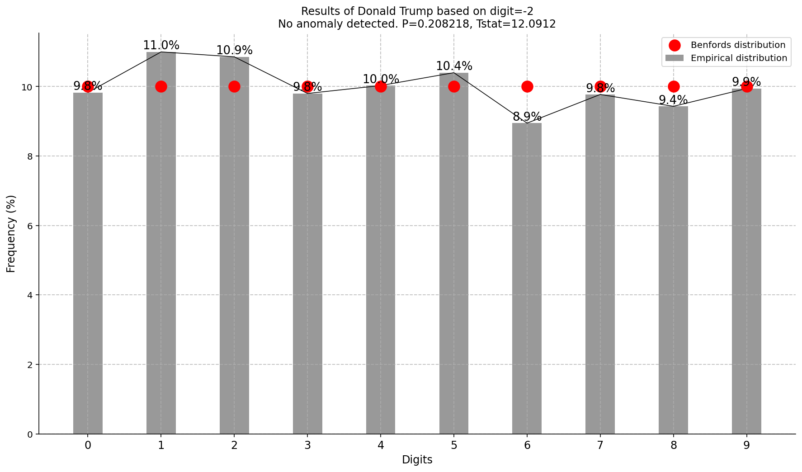

First digit test
####################################

In the following example we load the 2016 elections data of the USA for various candidates.
We will check whether the votes are fraudulent based on benfords distribution.

.. code:: python

	from benfordslaw import benfordslaw

	# Initialize
	bl = benfordslaw(alpha=0.05)

	# Load elections example
	df = bl.import_example(data='USA')

	# Extract election information.
	X = df['votes'].loc[df['candidate']=='Donald Trump'].values

	# Print
	print(X)
	# array([ 5387, 23618,  1710, ...,    16,    21,     0], dtype=int64)

	# Make fit
	results = bl.fit(X)

	# Plot
	bl.plot(title='Donald Trump')

.. |fig1| image:: ../figs/fig1.png

.. table:: First digit.
   :align: center

   +----------+
   | |fig1|   |
   +----------+

Second digit test
####################################

Let's check the the votes on the second digit and determine whether it significantly deviates from benfords distribution.

.. code:: python

	from benfordslaw import benfordslaw

	# Initialize
	bl = benfordslaw(pos=2)

	# Load elections example
	df = bl.import_example(data='USA')

	# Extract election information.
	X = df['votes'].loc[df['candidate']=='Donald Trump'].values

	# Make fit
	results = bl.fit(X)

	# Plot
	bl.plot(title='Results of Donald Trump based on 2nd digit', barcolor=[0.5, 0.5, 0.5], fontsize=12, barwidth=0.4)

.. |fig2| image:: ../figs/fig2nd_digit_votes.png

.. table:: Second digit.
   :align: center

   +----------+
   | |fig2|   |
   +----------+

Last digit test
####################################

Let's check the the votes on the **last digit** and determine whether it significantly deviates from benfords distribution.

.. code:: python

	from benfordslaw import benfordslaw

	# Initialize
	bl = benfordslaw(pos=-1)

	# Load elections example
	df = bl.import_example(data='USA')

	# Extract election information.
	X = df['votes'].loc[df['candidate']=='Donald Trump'].values

	# Make fit
	results = bl.fit(X)

	# Plot
	bl.plot(title='Results of Donald Trump based on 2nd digit', barcolor=[0.5, 0.5, 0.5], fontsize=12, barwidth=0.4)

.. table:: Last digit.
   :align: center

   +----------+
   | |fig3|   |
   +----------+

Second last digit test
####################################

Let's check the the votes on the **last digit** and determine whether it significantly deviates from benfords distribution.

.. code:: python

	from benfordslaw import benfordslaw

	# Initialize
	bl = benfordslaw(pos=-2)

	# Load elections example
	df = bl.import_example(data='USA')

	# Extract election information.
	X = df['votes'].loc[df['candidate']=='Donald Trump'].values

	# Make fit
	results = bl.fit(X)

	# Plot
	bl.plot(title='Results of Donald Trump based on 2nd digit', barcolor=[0.5, 0.5, 0.5], fontsize=12, barwidth=0.4)

.. table:: Second last digit.
   :align: center

   +----------+
   | |fig4|   |
   +----------+

.. raw:: html

	

	

		
	

	

