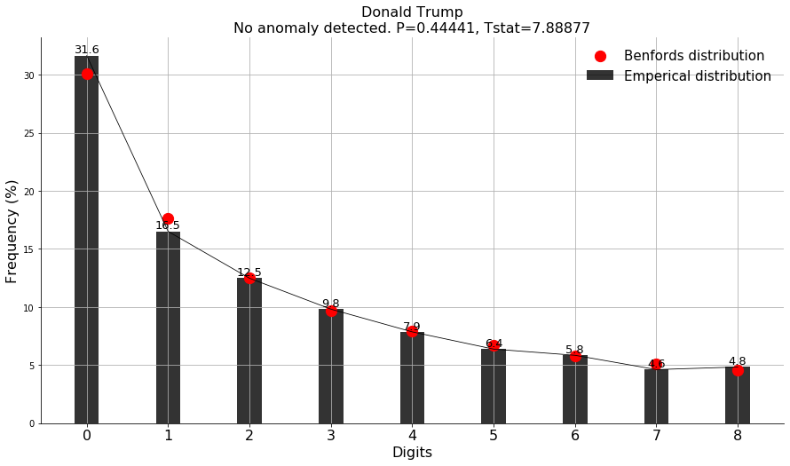

benfordslaw's documentation!
============================

``benfordslaw`` is Python package to test if an empirical (observed) distribution differs significantly from a theoretical (expected, Benfords) distribution. The law states that in many naturally occurring collections of numbers, the leading significant digit is likely to be small. This method can be used if you want to test whether your set of numbers may be artificial (or manipulated). If a certain set of values follows Benford's Law then model's for the corresponding predicted values should also follow Benford's Law. Normal data (unmanipulated) does trend with Benford's Law, whereas manipulated or fraudulent data does not.

**Assumptions of the data**

	* The numbers need to be random and not assigned, with no imposed minimums or maximums.
	* The numbers should cover several orders of magnitude
	* Dataset should preferably cover at least 1000 samples. Though Benford's law has been shown to hold true for datasets containing as few as 50 numbers.

.. table:: First digit.
   :align: center

   +----------+
   | |figd|   |
   +----------+

You contribution is important
==============================
If you ❤️ this project, **star** this repo at the `github page <https://github.com/erdogant/benfordslaw/>`_ and have a look at the `sponser page <https://erdogant.github.io/benfordslaw/pages/html/Documentation.html>`_!

Github
======
Please report bugs, issues and feature extensions at `github <https://github.com/erdogant/benfordslaw/>`_.

Content
=======

.. toctree::
   :maxdepth: 1
   :caption: Installation
   
   Installation

.. toctree::
  :maxdepth: 1
  :caption: Tutorials

  Tutorials

.. toctree::
  :maxdepth: 1
  :caption: Examples

  Examples

.. toctree::
  :maxdepth: 1
  :caption: Documentation
  
  Documentation
  Coding quality
  benfordslaw.benfordslaw

Indices and tables
==================

* :ref:`genindex`
* :ref:`modindex`
* :ref:`search`

.. raw:: html

	

	

		
	

	

